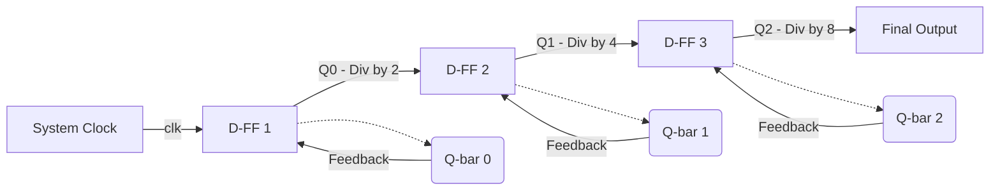

## 1. Overview

This document tracks the bridge between raw silicon logic and software execution, consolidating everything from binary arithmetic and IEEE 754 representations to instruction set architectures (ISAs) and sequential logic gates. A CPU is just a massive state machine built out of billions of voltage-switching transistors. To write high-performance software, especially close to the metal, we have to understand exactly how the hardware maps those binary voltage levels to memory addresses, how it routes execution through pipelines, and how it persists state using feedback loops in clocked memory units.

## 2. Theoretical Foundations

### 2.1 Integer and Real Number Representation

The underlying hardware operates entirely on two voltage levels: ON (1) and OFF (0). Base-2 (binary) is the native numerical system, but representing negative numbers and fractional values requires specific bit-level mapping formats. 

**Theoretical Intuition**

For integers, older architectures tried *Signed Magnitude* (using the most significant bit as a sign indicator) and *One's Complement* (flipping bits for negatives). Both suffer from the "Two Zeroes" problem—producing a positive and negative zero—which wastes bits and complicates ALU hardware. *Two's Complement* solves this by offsetting the negative representation by one, leaving exactly one zero and smoothing out binary addition circuits.

For real numbers, scaling integers (Fixed-Point) lacks dynamic range. If we need to represent both $3.625 \times 10^{-18}$ and large gigahertz frequencies, we need a floating-point system that mimics scientific notation. The IEEE 754 standard splits the binary into three components: a sign bit, a biased exponent, and a normalized mantissa (fraction).

**Mathematical Derivation**

To calculate a Two's Complement negative number ($N^*$):
$$N^* = (\sim N) + 1$$

To represent a real number using IEEE 754 single-precision (32-bit):
$$V = (-1)^s \times 1.M \times 2^{E - Bias}$$
Where:
* $s$ is the sign bit (1 bit).
* $M$ is the Mantissa / fraction (23 bits).
* $E$ is the Exponent (8 bits).
* $Bias$ is $127$ for single precision (and $1023$ for double precision).

**Programmatic Implementation**

Here's how this memory representation works in practice. This C snippet dumps the exact IEEE 754 bit layout of a floating-point number as the hardware stores it.

```c
#include <stdio.h>
#include <stdint.h>

void print_ieee754_bits(float f) {
    // Treat the float's memory address as an unsigned 32-bit int pointer
    uint32_t bits = *(uint32_t*)&f;
    
    uint32_t sign = (bits >> 31) & 1;
    uint32_t exp = (bits >> 23) & 0xFF;
    uint32_t mantissa = bits & 0x7FFFFF;
    
    printf("Float: %f\n", f);
    printf("Sign: %u | Exp: 0x%02X (%u) | Mantissa: 0x%06X\n", 
           sign, exp, exp, mantissa);
}

int main() {
    print_ieee754_bits(-32.75f);
    return 0;
}
```

### 2.2 Memory Architectures and Endianness

Memory is essentially a massive, contiguous array of bytes. However, when we store multi-byte data types (like a 32-bit integer), the hardware has to decide the byte order. 

**Theoretical Intuition**

A CPU's ISA defines its endianness. *Big-endian* stores the most significant byte (the "big end") at the lowest memory address. This is highly readable in hex dumps because it reads left-to-right like standard text. *Little-endian* stores the least significant byte at the lowest address, which makes arithmetic logic simpler for the CPU (e.g., parallel byte-by-byte addition and typecasting variable lengths without shifting offsets).

**Mathematical Derivation**

If we have a 32-bit word $W = [B_3, B_2, B_1, B_0]$ stored at base memory address $A$:

* **Big-Endian Mapping:** Address $A + i$ stores $B_{3-i}$
* **Little-Endian Mapping:** Address $A + i$ stores $B_i$

**Programmatic Implementation**

We can dynamically check the endianness of our processor by observing how a 32-bit integer lays out its bytes in memory.

```c
#include <stdio.h>
#include <stdint.h>

int main() {
    uint32_t val = 0xAABBCCDD;
    // Cast address to byte pointer to inspect the lowest address
    uint8_t *ptr = (uint8_t *)&val;
    
    if (*ptr == 0xDD) {
        printf("Little-Endian: Lowest address holds 0xDD\n");
    } else if (*ptr == 0xAA) {
        printf("Big-Endian: Lowest address holds 0xAA\n");
    }
    return 0;
}
```

### 2.3 ARM Processor Architecture and Assembly

The ARM ISA is a RISC (Reduced Instruction Set Computer) architecture, meaning data processing only happens in registers. Memory is strictly accessed via Load (`LDR`) and Store (`STR`) instructions. 

**Theoretical Intuition**

Execution flows top-down, tracked by the Program Counter (`PC` / `R15`). To achieve control flow (if/else, loops, functions), we use Conditional Branches (`BEQ`, `BNE`) that evaluate hardware status flags (Negative, Zero, Carry, Overflow - NZCV). When calling functions, we must respect the ARM Procedure Call Standard (APCS) by managing the stack pointer (`SP` / `R13`) to preserve local state and the Link Register (`LR` / `R14`) to know where to return.

**Mathematical Derivation**

When an ARM CPU processes a PC-relative load or branch, it calculates the target address dynamically:
$$Addr_{target} = PC + Offset$$
Because the ARM pipeline pre-fetches instructions, the actual value of `PC` during execution is usually $Instruction\_Address + 8$ (in 32-bit ARM mode) or $+ 4$ (in Thumb mode).

**Programmatic Implementation**

Here is a block of ARM Assembly computing `R3 = 63 % 8` using bitwise logic (since 8 is a power of 2, modulo is just a bitwise AND with $8-1=7$).

```armasm
    AREA math_example, CODE, READONLY
    ENTRY

main
    MOV R0, #63      ; Load 63 into R0
    AND R3, R0, #7   ; R3 = 63 % 8 (63 & 7)
    
stop
    B stop           ; Infinite loop to halt program execution
    END
```

### 2.4 Sequential Logic & Frequency Dividers

Combinational logic (AND, OR, NOT) has no memory. To build registers and caches, we need Sequential Logic, which introduces feedback loops.

**Theoretical Intuition**

The fundamental memory unit is the SR (Set-Reset) Latch, which routes outputs back into inputs. But unclocked latches are unstable—they suffer from race conditions. The D Flip-Flop fixes this by locking data capture to the rising or falling edge of a clock signal. 

Crucially, wiring the inverted output ($\bar{Q}$) back into the data input ($D$) of a D Flip-Flop creates a toggle mechanism. Every clock cycle, it flips state. This effectively halves the input clock frequency, creating a hardware Frequency Divider or Ripple Counter.

**Mathematical Derivation**

The characteristic equation for a D Flip-Flop dictates its next state ($Q_{next}$) is simply whatever was at the input ($D$) on the clock edge:
$$Q_{next} = D$$

If we feed the inverted output back to the input ($D = \bar{Q}$), the output frequency $f_{out}$ across $n$ cascaded flip-flops is:
$$f_{out} = \frac{f_{in}}{2^n}$$

**Programmatic Implementation**

Here is a structural Verilog implementation of a 2-stage frequency divider that takes a high-speed clock and outputs a clock running at $1/4$ the speed.

```verilog
module d_flip_flop(
    input clk,
    input D,
    output reg Q,
    output Q_bar
);
    assign Q_bar = ~Q;
    always @(posedge clk) begin
        Q <= D;
    end
endmodule

module frequency_divider(
    input fast_clk,
    output div_2_clk,
    output div_4_clk
);
    wire q1_bar, q2_bar;
    
    // Stage 1: divides fast_clk by 2
    d_flip_flop ff1 (.clk(fast_clk), .D(q1_bar), .Q(div_2_clk), .Q_bar(q1_bar));
    
    // Stage 2: divides div_2_clk by 2 (total division by 4)
    d_flip_flop ff2 (.clk(div_2_clk), .D(q2_bar), .Q(div_4_clk), .Q_bar(q2_bar));
endmodule
```

## 3. Comparative Analysis

| Feature | RISC (e.g., ARM) | CISC (e.g., x86) |
| :--- | :--- | :--- |
| **Instruction Size** | Fixed size (e.g., 32-bit or 16-bit Thumb) | Variable size |
| **Memory Access** | Strict Load/Store architecture | Memory can be accessed directly by most instructions |
| **Code Density** | Lower (needs more instructions for same task) | Higher |
| **Hardware Complexity** | Simplified decoding, leaves heavy lifting to software | Complex decoding unit on the CPU |

| Architecture | Data/Instruction Memory | Bus Structure | Use Case |
| :--- | :--- | :--- | :--- |
| **Von Neumann** | Shared single memory space | Single bus | General purpose computers |
| **Harvard** | Physically separate memory units | Dual buses (simultaneous fetching) | Microcontrollers, DSPs |

| Endianness | Byte Ordering | Key Advantage |
| :--- | :--- | :--- |
| **Big-Endian** | MSB at lowest address | Highly human-readable in memory dumps |
| **Little-Endian** | LSB at lowest address | Easier parallel math, easy typecasting without shifting |

## 4. System / Sequence Architecture

Cascading D Flip-Flops to form a frequency divider creates an asynchronous ripple counter. Notice how the output of one flip-flop acts as the clock for the next in the sequence.



## 5. Worked Examples

**Example 1: Hexadecimal 2's Complement Conversion**
*Problem:* Convert $-198_{10}$ to 16-bit hexadecimal using 2's complement.

1. Find $+198$ in 16-bit binary: 
   $198 = 128 + 64 + 4 + 2$
   `0000 0000 1100 0110`
2. Apply 1's Complement (Flip bits): 
   `1111 1111 0011 1001`
3. Add 1 (2's Complement): 
   `1111 1111 0011 1010`
4. Group by 4 to convert to Hex:
   `1111` $\rightarrow$ `F`
   `1111` $\rightarrow$ `F`
   `0011` $\rightarrow$ `3`
   `1010` $\rightarrow$ `A`
   **Result:** `0xFF3A`

**Example 2: IEEE 754 Floating-Point Conversion**
*Problem:* Convert $-32.75$ into IEEE Single-Precision format.

> The source notes listed a bias addition of 1023 (Double Precision) but then calculated `5 + 127 = 132`, which is the Single Precision bias. I'm executing this example fully in 32-bit Single Precision to keep the mathematics internally consistent.

1. Determine Sign Bit: Negative, so $S = 1$.
2. Convert integer part to binary: $32 = 100000_2$
3. Convert fractional part to binary: 
   $0.75 \times 2 = 1.5 \rightarrow 1$
   $0.50 \times 2 = 1.0 \rightarrow 1$
   Fraction = $.11$
4. Combine: $100000.11_2$
5. Normalize to scientific notation: $1.0000011 \times 2^5$
6. Calculate Biased Exponent: $E = 5 + 127 = 132 = 10000100_2$
7. Extract Mantissa (drop leading 1, pad to 23 bits):
   `0000 0110 0000 0000 0000 000`
8. Assemble: `1 | 1000 0100 | 0000 0110 0000 0000 0000 000`
   Grouping to hex: `1100 0010 0000 0011 0000 0000 0000 0000` $\rightarrow$ **`0xC2030000`**

**Example 3: Endianness Memory Mapping**
*Problem:* Map `struct myData` initialized with `x = {'c', 0xAABB, -88, 0xDEADBEEF}` into a Big-Endian 32-bit system starting at `0x10000000`.

> The source problem initialized five values (`'c', 0xAABB, -88, 20, 0xDEADBEEF`) for a struct with only four members. I have removed the anomalous `20` so the assignment aligns with the four defined struct members (`char`, `unsigned short`, `short`, `char*`). I am also assuming a packed struct (no padding) for this academic exercise. 

* `char a` = `'c'` = `0x63` (1 byte)
* `unsigned short b` = `0xAABB` (2 bytes)
* `short d` = `-88` = `0xFFA8` (2 bytes, 2's complement)
* `char* e` = `0xDEADBEEF` (4 bytes, 32-bit pointer)

| Address | Value (Hex) | Struct Member |
| :--- | :--- | :--- |
| `0x10000000` | `63` | `a` |
| `0x10000001` | `AA` | `b` (Big-Endian MSB) |
| `0x10000002` | `BB` | `b` (Big-Endian LSB) |
| `0x10000003` | `FF` | `d` (Big-Endian MSB) |
| `0x10000004` | `A8` | `d` (Big-Endian LSB) |
| `0x10000005` | `DE` | `e` (Big-Endian MSB) |
| `0x10000006` | `AD` | `e` |
| `0x10000007` | `BE` | `e` |
| `0x10000008` | `EF` | `e` (Big-Endian LSB) |

**Example 4: ARM Status Flags Mapping**
*Problem:* What is the value in NZCV after running this code?
```armasm
MOV R1, #0x7FFFFFFF
SUBS R1, R1, #1
```

* `R1` starts as `0x7FFFFFFF` (the maximum positive 32-bit signed integer).
* `SUBS` subtracts `1` and updates status flags. 
* Result is `0x7FFFFFFE`.
* **N (Negative):** `0`. The MSB is still 0 (number is positive).
* **Z (Zero):** `0`. The result is not exactly zero.
* **C (Carry):** `1`. In ARM, subtraction is done as $A + (\sim B) + 1$. Because there's no borrow needed (we subtracted a smaller number from a larger one), the Carry flag acts as the NOT-Borrow flag and remains set to `1`.
* **V (Overflow):** `0`. No signed overflow occurred (we didn't cross from positive into negative capacity limits).

## 6. Common Pitfalls

> Do not mismatch stack operations in ARM assembly. The number of `PUSH` operations must perfectly mirror the `POP` operations in reverse order. Failing this rule throws off the Stack Pointer (`SP`), causing a crash when the program attempts to `BX LR` back to a garbage memory address.

> When working with SR Latches, inputting `S=1, R=1` is functionally invalid. It forces both $Q$ and $\bar{Q}$ to output `0`, violating the fundamental rule that the outputs must be logical complements of each other. 

> Do not apply the Two's Complement inversion to positive numbers when converting to Hex/Binary. The Most Significant Bit already signifies it's positive (`0`). You only flip and add one when representing a negative number or finding the negative counterpart.