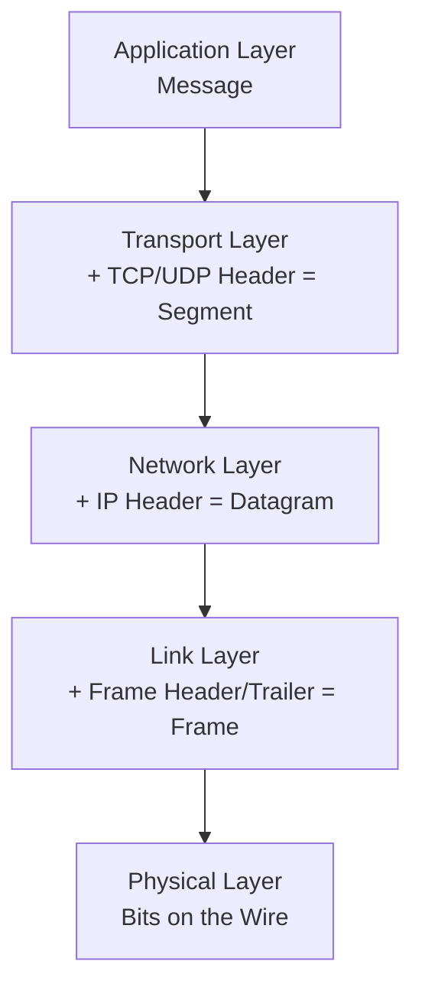
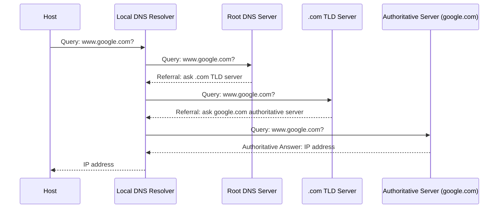
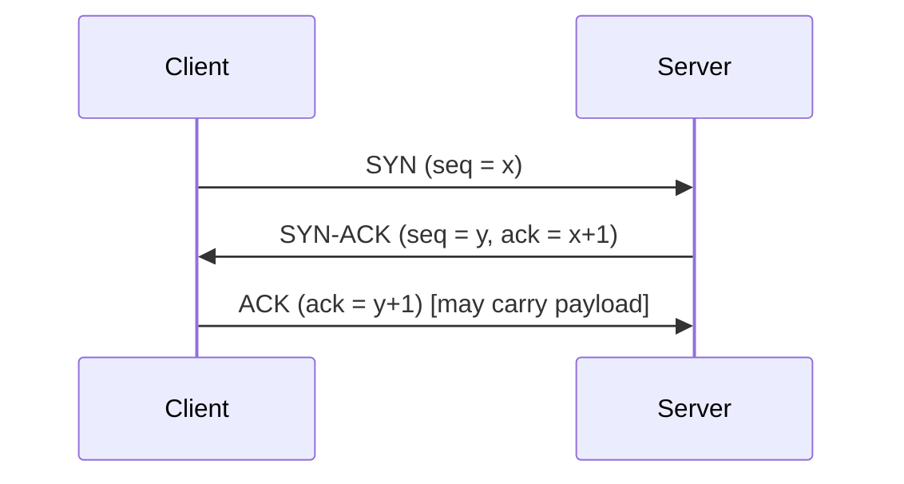
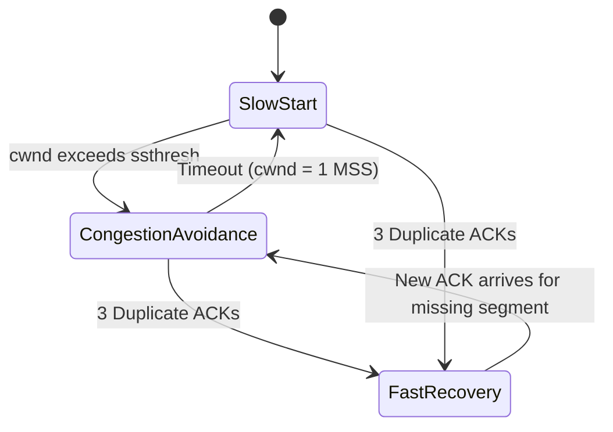

## 1. Overview

These are my notes on the first three chapters of the networking sequence — network architecture, the application layer, and the transport layer — pulled together into one reference I can actually study from. The throughline across all three chapters is the same: the Internet has to move bits from one host to another over unreliable, shared, physically limited infrastructure, and every design decision in this course is really just a different answer to that constraint. I'm covering the edge/core split, how packet delay actually breaks down into four separate components, why the layered protocol stack looks the way it does, how HTTP/DNS/SMTP/BitTorrent work at the application layer, and how TCP fakes reliability and fairness on top of a network that guarantees neither. Every concept below goes intuition → math → implementation, because that's the order that actually makes the formulas stick instead of just memorizing them for the exam.

## 2. Theoretical Foundations

### 2.1 The Network Edge and the Network Core

**Intuition.** Every packet-switched network splits into two structurally different regions. The **edge** is where end systems — the actual clients and servers people interact with — attach to the network. The problem the edge has to solve is *access*: how does a host, whether it's a phone on a cellular link or a server sitting in a data center, get its bits onto the network in the first place? The **core** doesn't care about attachment at all — it's a dense mesh of routers whose only job is forwarding: move a packet from one link to the next until it reaches its destination.

This split matters because the edge and the core optimize for completely different things. The edge deals with heterogeneity — DSL, cable/HFC, fiber, and wireless links all coexist, and whether an access network shares bandwidth (cable) or dedicates it (DSL) determines how much a neighbor's traffic eats into your own throughput. The core optimizes for scale — a single router might be forwarding for millions of concurrent flows, so its whole design centers on how efficiently it multiplexes those flows onto shared links.

**Derivation — packet switching vs. circuit switching.** The core's fundamental design choice is *how* it multiplexes flows onto a shared link. Circuit switching reserves resources for a connection's entire duration using Frequency-Division or Time-Division Multiplexing. If a link has capacity $R$ and is split among $N$ simultaneous circuits, each one is guaranteed:

$$
r_{circuit} = \frac{R}{N}
$$

regardless of whether that circuit is actively sending anything. That's a guarantee, but it wastes capacity during silence — think pauses in a voice call.

Packet switching instead uses **store-and-forward**: a switch has to receive a packet in full before it can forward any of it, and it multiplexes packets from many flows onto the outbound link *on demand*, through a queue. That means a flow can, in principle, grab the entire link rate $R$ when other flows are idle — but it also means it might sit behind other packets first, which is queuing delay with no upper bound guaranteed.

**Implementation — modeling the trade-off.**

```python
def circuit_switch_capacity(link_rate_bps: float, num_circuits: int) -> float:
    """Each circuit gets a fixed, guaranteed slice — regardless of whether it's actually sending."""
    return link_rate_bps / num_circuits


def packet_switch_expected_wait(arrival_rate: float, service_rate: float) -> float:
    """
    Simplified M/M/1-style intuition: as traffic intensity (a = arrival_rate / service_rate)
    approaches 1, expected queuing delay blows up — unlike circuit switching's flat guarantee.
    """
    traffic_intensity = arrival_rate / service_rate
    if traffic_intensity >= 1:
        return float("inf")  # queue saturates, delay is unbounded
    return traffic_intensity / (service_rate * (1 - traffic_intensity))
```

> Packet switching isn't just "better" than circuit switching — it's better *for bursty traffic specifically*. For genuinely constant-rate traffic (uncompressed voice, for example), a circuit's guaranteed allocation can beat a congested packet-switched path.

### 2.2 Delay, Loss, and the Four Sources of Nodal Delay

**Intuition.** A packet's trip across a single hop is never instant. It gets delayed by four separate, additive processes: the router has to *look at* it (processing), *wait its turn* to be sent (queuing), *push the bits onto the wire* (transmission), and *travel* along the medium (propagation). Knowing which of the four dominates in a given scenario is probably the single most-tested skill in this unit, because each has a different cause and a different fix.

**Derivation.** For node $A$ forwarding to node $B$ across one link, total nodal delay is:

$$
d_{nodal} = d_{proc} + d_{queue} + d_{trans} + d_{prop}
$$

- $d_{proc}$ — **processing delay**: examining the header, checking for bit errors, figuring out the outbound link. Microseconds, roughly independent of packet size or congestion.
- $d_{queue}$ — **queuing delay**: time waiting in the output buffer before transmission. Highly variable, no closed-form formula in general traffic conditions — it's the one term that actually depends on how congested the router currently is.
- $d_{trans}$ — **transmission delay**: time to push all of a packet's bits onto the link:

$$
d_{trans} = \frac{L}{R}
$$

  where $L$ is packet length in bits and $R$ is the link's bandwidth in bits per second.

- $d_{prop}$ — **propagation delay**: time for a bit, once on the wire, to physically travel the link:

$$
d_{prop} = \frac{d}{s}
$$

  where $d$ is physical distance and $s$ is the propagation speed of the medium (a bit under the speed of light, typically $2 \times 10^8$ to $3 \times 10^8 \ \text{m/s}$ depending on the medium).

> Transmission and propagation delay get mixed up a lot because both depend on physical link properties, but they're modeling different things. Transmission delay is about *serializing* a packet onto the wire — depends on packet size and bandwidth, not distance. Propagation delay is about a signal *traversing* the medium — depends on distance, not packet size. A satellite link can have negligible transmission delay but huge propagation delay, and a short, badly oversubscribed local link can be the opposite.

**Implementation.**

```python
def nodal_delay(processing_s: float, queuing_s: float, packet_bits: float, link_rate_bps: float,
                 distance_m: float, propagation_speed_mps: float) -> float:
    d_proc = processing_s
    d_queue = queuing_s
    d_trans = packet_bits / link_rate_bps
    d_prop = distance_m / propagation_speed_mps
    return d_proc + d_queue + d_trans + d_prop
```

### 2.3 Worked Example: End-to-End File Transfer Delay

**The problem** (from the reinforcement set): Host A sends a 5 MB file to Host B. Distance is 10,000 km, propagation speed is $2 \times 10^8 \ \text{m/s}$, link bandwidth is 10 Mbps. Zero queuing or processing delay. How long from the first bit sent to the last bit received?

**Derivation.**

Transmission delay — pushing the whole 5 MB file (5,000,000 bytes × 8 = 40,000,000 bits) onto a 10 Mbps link:

$$
d_{trans} = \frac{L}{R} = \frac{40{,}000{,}000 \ \text{bits}}{10 \times 10^6 \ \text{bits/s}} = 4 \ \text{seconds}
$$

Propagation delay — time for the *last* bit to cross the 10,000 km link once it's on the wire:

$$
d_{prop} = \frac{d}{s} = \frac{10{,}000{,}000 \ \text{m}}{2 \times 10^8 \ \text{m/s}} = 0.05 \ \text{seconds}
$$

> Propagation delay isn't incurred per-bit and then summed — it's incurred once, by the last bit, since transmission and propagation happen concurrently (the first bit is already traveling down the wire while later bits are still being pushed on). The last bit finishes transmission at $t = d_{trans}$ and then still needs $d_{prop}$ more seconds to actually arrive.

$$
d_{total} = d_{trans} + d_{prop} = 4 + 0.05 = 4.05 \ \text{seconds}
$$

## 3. Protocol Layering and Encapsulation

**Intuition.** The Internet splits its functionality into layers so each one can be built, upgraded, and reasoned about independently — a layer only has to trust the *interface* the layer below exposes, not how that layer is actually implemented. Each layer takes whatever data unit it's handed from above, wraps it in its own header (sometimes a trailer too), and passes the result down — that's **encapsulation**.

| Layer | Protocol Data Unit (PDU) | Logical Communication Between | Representative Protocols |
|---|---|---|---|
| Application | Message | Processes | HTTP, DNS, SMTP |
| Transport | Segment | Processes (host-to-host, port-addressed) | TCP, UDP |
| Network | Datagram | Hosts | IP |
| Link | Frame | Neighboring network elements | Ethernet, PPP |
| Physical | Bits | — | Copper, fiber, radio |



> It's easy to conflate "transport" and "network" since both sit below the application layer, but they solve different addressing problems. The **network layer** provides logical communication between *hosts* — IP addresses identify machines. The **transport layer** provides logical communication between *processes* on those hosts — port numbers identify which application should get the data. One host, one IP address, thousands of concurrently open sockets, all distinguished at the transport layer.

## 4. The Application Layer

### 4.1 Application Architectures

**Intuition.** Every distributed application has to decide how responsibility is spread across the end systems involved, and there are two dominant answers, each with different scalability and manageability consequences.

| Property | Client-Server | Peer-to-Peer (P2P) |
|---|---|---|
| Server presence | Always-on host with a permanent, known IP | No dedicated always-on server required |
| Client-to-client communication | Clients never talk to each other directly | Peers talk to each other directly |
| Scalability | Bottlenecked by server capacity | Self-scaling — every new peer adds capacity |
| Manageability | Simple to secure and administer | Harder — peer churn, dynamic IPs |
| Typical use case | HTTP, IMAP, traditional web apps | BitTorrent |

### 4.2 Transport Services Available to Applications: TCP vs. UDP

**Intuition.** Every application-layer protocol sits on top of one of the two transport services the Internet offers, and the choice comes down to how much reliability you're willing to pay for in overhead and latency.

| Property | TCP | UDP |
|---|---|---|
| Connection model | Connection-oriented (requires handshake) | Connectionless |
| Reliability | Guaranteed, in-order delivery | No delivery, ordering, or duplication guarantee |
| Congestion control | Yes — adjusts sending rate to network conditions | None |
| Overhead | Higher (handshake, ACKs, retransmission state) | Minimal |
| Typical use cases | Web (HTTP), email (SMTP), file transfer | DNS queries, real-time media, QUIC/HTTP-3 |

### 4.3 HTTP (HyperText Transfer Protocol)

**Intuition.** HTTP is the Web's application-layer protocol, built on TCP, and it's deliberately **stateless** — the server keeps no memory of prior requests from a given client. Statelessness keeps server design simple (no per-client session state baked into the transport protocol), but it pushes application state (logins, carts) onto a separate bolt-on: cookies.

**Derivation — non-persistent vs. persistent connections.** Fetching $n$ objects (a base HTML page plus embedded images, say) costs very different amounts depending on the HTTP version, because of how many TCP connections and round trips get spent.

Under **non-persistent HTTP** (HTTP/1.0-style behavior), every object gets its own TCP connection: 1 RTT for the handshake plus roughly 1 RTT for the request/response itself, before transmission time even enters the picture:

$$
T_{non\text{-}persistent} = n \times (2 \cdot RTT) + T_{trans}
$$

Under **persistent HTTP** (the HTTP/1.1 default), one TCP connection gets reused: 1 RTT for the initial handshake, plus — in the simple serial-request model used for exam-style calculations — 1 RTT per subsequently requested object:

$$
T_{persistent} = RTT_{handshake} + \sum_{i=1}^{n} RTT_i
$$

> In principle, HTTP/1.1 pipelining can overlap requests and get as low as $RTT_{handshake} + RTT_{base} + 1$ extra RTT if every remaining object is requested back-to-back without waiting serially for each response. But a lot of course-level calculations model persistent HTTP conservatively as **serial** requests over the reused connection — 1 RTT per object — which is the convention I'm using in the worked example below. Worth double-checking which convention a given problem expects.

**Worked example.** Base HTML page plus 5 embedded images (6 objects total), non-persistent HTTP:

$$
\text{Total RTTs} = 6 \times 2 = 12 \ \text{RTTs}
$$

Persistent HTTP, modeled as 1 RTT handshake + 1 RTT base HTML + 1 RTT per image:

$$
\text{Total RTTs} = 1 + 1 + 5 = 7 \ \text{RTTs}
$$

**Derivation — Head-of-Line (HOL) blocking.** HTTP/1.1's persistent connection reuses a *single* TCP byte stream for multiple objects. Because TCP guarantees strictly in-order delivery, if the segment carrying one response gets lost, every object queued behind it on that connection is stuck — even if their bytes already physically arrived — until the lost segment is retransmitted and received. That's HOL blocking. HTTP/2 tries to fix this at the application layer by splitting objects into interleaved **frames**, but since HTTP/2 still runs over one TCP connection, the underlying transport-layer HOL blocking is still there. HTTP/3 actually kills it by swapping TCP for QUIC (§5.6).

**Implementation — a raw HTTP/1.1 request.**

```http
GET /index.html HTTP/1.1
Host: www.example.com
Connection: keep-alive
Accept: text/html
```

### 4.4 Cookies

**Intuition.** Since HTTP itself is stateless, cookies are the out-of-band bolt-on that lets a server recognize a returning client across otherwise unrelated requests.

Four moving parts: a `Set-Cookie` header in the response, a `Cookie` header echoed in later requests, a cookie file stored on the user's machine, and a backend database on the server mapping cookie values to session/account state.

### 4.5 DNS (Domain Name System)

**Intuition.** Humans address hosts by name (`www.google.com`); routers address them by IP. DNS is the distributed database and lookup protocol that bridges the two. It's deliberately distributed and hierarchical instead of centralized — no single server could handle global query volume, and hierarchy gives fault tolerance too.

**Derivation — query resolution.** Resolution can be **iterative** or **recursive**. Iterative: every contacted server just returns a referral ("don't know, try this server instead"), pushing the work of chasing the chain back onto the querying resolver. Recursive: the contacted server chases the whole chain itself and hands back only the final answer.



**Resource record types.**

| Record Type | Maps | Example |
|---|---|---|
| A | Hostname → IPv4 address | `www.example.com → 93.184.216.34` |
| NS | Domain → Authoritative name server | `example.com → ns1.example.com` |
| CNAME | Alias → Canonical hostname | `ftp.example.com → example.com` |
| MX | Domain → Mail server hostname | `example.com → mail.example.com` |

**Caching and security.** Resolvers cache responses (keyed by TTL) to cut down latency and load on upstream servers. That caching layer is also DNS's biggest attack surface: **cache poisoning** injects forged records to redirect traffic. **DNSSEC** fixes this with cryptographic signatures that let a resolver verify a response actually came from the claimed authoritative source and wasn't tampered with.

> Connecting to a service by raw IP address instead of a hostname skips DNS resolution entirely — DHCP (get a local IP), ARP (resolve the next-hop MAC address), TCP (handshake), and HTTP/TLS still all happen, but there's no name-to-address translation to do.

### 4.6 Electronic Mail: SMTP and Access Protocols

SMTP is a **push** protocol for moving mail between mail servers and from a client to its outgoing server, running over TCP port 25 with ASCII-encoded messages. Because SMTP is push-only, a separate class of protocol is needed for a recipient to *pull* mail from their inbox — POP3, IMAP, or HTTP-based webmail all fill that role.

### 4.7 Peer-to-Peer File Distribution: BitTorrent

**Intuition.** In pure client-server distribution, distribution time grows roughly linearly with the number of clients, because the server's fixed upload bandwidth is the shared bottleneck for every requester. P2P breaks that bottleneck by having every downloading peer simultaneously re-upload the pieces it already has, so total distribution capacity grows *with* the swarm instead of staying fixed.

**Mechanism.** BitTorrent splits files into fixed-size chunks. A **tracker** helps peers find each other. Two design choices give it good performance and fairness:

- **Rarest-first chunk selection** — prioritize downloading whichever chunks are least replicated across the swarm, keeping availability balanced so no single chunk becomes a bottleneck.
- **Tit-for-tat** — preferentially upload to peers who are uploading back to you, which rewards reciprocal contribution and discourages free-riding.

### 4.8 Internet Video and Content Distribution Networks (CDNs)

HD video streaming (roughly 100 kbps–4 Mbps, 4K pushing ~10 Mbps) usually gets delivered via **HTTP streaming**: a client opens a normal TCP connection to an HTTP server, issues GET requests for successive chunks of a pre-recorded file, and buffers frames ahead of the playback point. A single data center can't serve a global audience with decent latency, so **CDNs** replicate content across geographically distributed clusters so each client hits a nearby copy, cutting both delay and backbone load.

## 5. The Transport Layer

### 5.1 Multiplexing and Demultiplexing

**Intuition.** A single host runs plenty of networked applications at once, all sharing one IP address. Demultiplexing is how the transport layer figures out which socket, on that one host, an incoming segment actually belongs to.

| Protocol | Demultiplexing Key | Consequence |
|---|---|---|
| UDP | Destination port only | Segments from different source IPs hitting the same destination port land on the *same* socket |
| TCP | Full 4-tuple: (source IP, source port, destination IP, destination port) | Each distinct client connection gets its own dedicated socket, even if every client targets the same destination port |

### 5.2 Principles of Reliable Data Transfer (RDT)

**Intuition.** UDP hands back zero reliability guarantees; TCP has to build reliability from nothing on top of an unreliable network layer. The RDT sequence is basically the step-by-step derivation of exactly which mechanism fixes exactly which failure mode.

**Derivation — building it up incrementally.**

- **RDT 2.0 (stop-and-wait with ACK/NAK):** send one packet, wait for an ACK or NAK before sending the next. Assumes packets can get corrupted but never lost. **Flaw:** if the ACK/NAK itself gets corrupted, the sender has no way to know whether to retransmit or move on.
- **RDT 2.1:** adds a 1-bit sequence number (0/1) to every packet so the receiver can tell a genuinely new packet apart from a retransmission caused by a corrupted ACK — this closes RDT 2.0's flaw without even needing NAKs (a corrupted or missing ACK can just be treated as a NAK).
- **RDT 3.0:** adds a **timer**, so the sender can detect and recover from outright packet *loss* (not just corruption) by retransmitting when no ACK shows up within a timeout window.

**Implementation — simplified stop-and-wait state machine.**

```python
class RDT3Sender:
    def __init__(self, timeout_s: float):
        self.seq_num = 0
        self.timeout_s = timeout_s

    def send(self, packet, network):
        acked = False
        while not acked:
            network.transmit(self.seq_num, packet)
            ack = network.wait_for_ack(timeout=self.timeout_s)  # None if the timer expires
            if ack is not None and ack.seq_num == self.seq_num and not ack.corrupted:
                acked = True
        self.seq_num ^= 1  # flip 0 <-> 1 for the next packet
```

### 5.3 Pipelined Reliable Data Transfer: Go-Back-N vs. Selective Repeat

**Intuition.** Stop-and-wait leaves the link idle while it waits on every ACK, which wastes bandwidth whenever RTT is large relative to transmission time. Pipelined protocols let the sender have multiple unacknowledged packets in flight at once, bounded by a window size $N$.

| Property | Go-Back-N (GBN) | Selective Repeat (SR) |
|---|---|---|
| Receiver behavior on out-of-order packet | Discards it | Buffers it |
| Acknowledgment style | Cumulative ACK | Individual ACK per packet |
| Action on timeout | Retransmits the **entire window** | Retransmits **only** the specific lost packet |
| Receiver complexity | Simple ("dumb") | More complex (needs buffering) |

**Worked example.** GBN with window size 4: sender transmits packets 0, 1, 2, 3. Packet 1 is lost; 0, 2, and 3 arrive fine.

- The receiver, being cumulative and unable to accept anything past the gap, sends: `ACK0` (for packet 0), then `ACK0` again for packet 2 (duplicate — packet 1 is still missing), then `ACK0` again for packet 3 (also duplicate).
- When the sender's timer for packet 1 expires, GBN does what defines it: it retransmits the **whole window** — packets **1, 2, and 3** — even though 2 and 3 already arrived correctly the first time.

### 5.4 TCP Connection Management: The Three-Way Handshake

TCP is connection-oriented and full-duplex (data flows both directions at once once it's set up), with exactly one sender and one receiver per connection. Setting up a connection requires an explicit handshake before either side can send application data.



Once the connection's up, TCP funnels application data into a **send buffer**, chunks it into segments no bigger than the **Maximum Segment Size (MSS)** — typically 1460 bytes, from a 1500-byte Ethernet MTU minus a 40-byte TCP/IP header — and hands those segments down to the network layer.

### 5.5 TCP Congestion Control

**Intuition.** Flow control protects the *receiver* from being overwhelmed; congestion control protects the *network* from being overwhelmed. TCP senders have no direct visibility into router queue depths, so they have to *infer* congestion indirectly — from timeouts and duplicate ACKs — and throttle themselves accordingly. A **loss event** is defined as either a timeout or the receipt of three duplicate ACKs.

**Derivation — slow start.** At connection start, `cwnd` initializes small (1 MSS). Since available bandwidth is usually way bigger than that conservative starting point, TCP grows `cwnd` **exponentially** — doubling roughly every RTT — until it hits a loss event or reaches the slow-start threshold `ssthresh`:

$$
cwnd_{i+1} = 2 \times cwnd_i \quad \text{(per RTT, during Slow Start)}
$$

**Derivation — congestion avoidance.** Once `cwnd > ssthresh`, TCP switches to a much more conservative **linear** growth of exactly 1 MSS per RTT (additive increase), usually implemented as incrementing `cwnd` by $MSS^2 / cwnd$ for every arriving ACK so the net effect over a full RTT of ACKs is a +1 MSS increase:

$$
cwnd_{i+1} = cwnd_i + MSS \quad \text{(per RTT, during Congestion Avoidance)}
$$

**Derivation — multiplicative decrease on loss.** On a loss event, TCP Reno reacts differently depending on how the loss was detected:

$$
\begin{aligned}
\text{On Timeout:} \quad & ssthresh_{new} = \frac{cwnd_{old}}{2}, \quad cwnd_{new} = 1\ MSS \quad \text{(back to Slow Start)} \\[4pt]
\text{On 3 Duplicate ACKs:} \quad & ssthresh_{new} = \frac{cwnd_{old}}{2}, \quad cwnd_{new} = ssthresh_{new} + 3\ MSS \quad \text{(into Fast Recovery)}
\end{aligned}
$$

This whole pattern — linear growth, then halving on loss — is **AIMD** (Additive Increase, Multiplicative Decrease), and it's what produces TCP's characteristic sawtooth throughput graph.

**Worked example.** TCP Reno sender in Congestion Avoidance with $cwnd = 10{,}000$ bytes, $MSS = 1{,}000$ bytes, and a loss event occurs.

1. **Detected by timeout:** $ssthresh = 10{,}000 / 2 = 5{,}000$ bytes; $cwnd$ drops all the way to $1{,}000$ bytes (1 MSS), back into Slow Start.
2. **Detected by 3 duplicate ACKs:** $ssthresh = 5{,}000$ bytes; $cwnd = ssthresh + 3 \times MSS = 5{,}000 + 3{,}000 = 8{,}000$ bytes, into Fast Recovery before dropping into Congestion Avoidance — a much softer penalty than a full reset.



> Fast Recovery is **recommended, not required** — TCP Tahoe, the older variant, resets `cwnd` all the way to 1 MSS on *any* loss event, timeout or triple-duplicate-ACK alike. Reno (and Cubic) treat triple-duplicate-ACK loss more leniently through Fast Recovery, on the logic that duplicate ACKs arriving at all is evidence the network can still deliver *some* segments. Modern TCP is Reno/Cubic-based, not Tahoe.

### 5.6 QUIC and the Evolution of Transport-Layer Functionality

**Intuition.** HTTP/2's stream multiplexing still runs over one TCP connection, so a single lost TCP segment stalls *every* multiplexed stream until it's retransmitted — the transport-layer HOL blocking from §4.3 never actually goes away no matter how cleverly the application layer interleaves frames. QUIC fixes this by pulling stream-aware reliability out of TCP entirely and building a new transport on top of UDP, in user space.

**Mechanism.** QUIC is connection-oriented and fully encrypted, with its own handshake to set up connection state. It supports multiple independent, multiplexed **streams** within one QUIC connection, each with its own reliable, in-order delivery guarantee. Because reliability is enforced *per stream* instead of across the whole connection, a lost UDP segment only stalls the stream(s) whose data it was carrying — every other stream keeps delivering to the application uninterrupted. HTTP/3 gives each object on a page its own QUIC stream, which is exactly why it kills the transport-level HOL blocking that HTTP/2 couldn't.

```python
# Conceptual contrast: TCP forces strict in-order delivery across ALL multiplexed HTTP/2 requests,
# so one lost segment blocks every stream. QUIC only enforces order WITHIN each stream.

def tcp_style_delivery(segments_in_flight_order):
    # a single lost segment blocks delivery of every later segment, regardless of stream
    return "delivery halts at first gap, for ALL streams"

def quic_style_delivery(streams: dict):
    # each stream is reliably ordered independently; a loss in stream A doesn't touch stream B
    return {stream_id: "delivers independently, in-order, per stream" for stream_id in streams}
```

## 6. Summary Comparison: Reliability Mechanisms Across the Stack

| Mechanism | Layer | Detects | Recovers Via |
|---|---|---|---|
| RDT 3.0 sequence numbers + timer | Transport (conceptual model) | Corruption and loss | Retransmission on timeout |
| TCP cumulative ACK + retransmission timer | Transport | Loss (timeout or 3 dup ACKs) | Retransmission + AIMD rate adaptation |
| DNSSEC signatures | Application (DNS) | Cache poisoning / tampering | Cryptographic verification |
| QUIC per-stream sequencing | Transport (over UDP) | Loss, isolated per stream | Per-stream retransmission, avoiding cross-stream HOL blocking |

## 7. Common Pitfalls

> Don't sum propagation delay per-bit — it's incurred once, by the last bit, concurrently with transmission of the earlier bits.

> Network layer addresses *hosts*; transport layer addresses *processes*. Don't conflate IP addressing with port-based demultiplexing.

> Persistent HTTP/1.1 throughput calculations depend on convention (serial 1-RTT-per-object vs. pipelined) — always be clear which one's in play.

> Only Reno/Cubic-style TCP enters Fast Recovery on triple-duplicate ACKs; Tahoe resets to Slow Start on any loss. Modern TCP is Reno/Cubic-based.