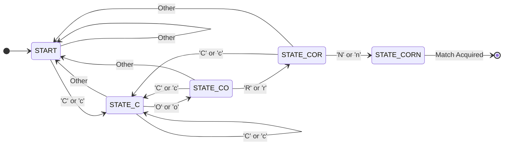

## 1. Overview

This document serves as my complete reference for advanced data structures and algorithms, moving beyond linear arrays and linked lists into the messy reality of trees, graphs, and probabilistic data structures. I am documenting the full pipeline required to build robust software systems—from manipulating individual bits for memory-efficient state tracking, to building recursive descent parsers that evaluate context-free grammars, to implementing self-balancing search trees and priority-driven heaps. By rooting these concepts in their mathematical foundations and backing them with concrete C++ implementations, this acts as a definitive blueprint for applying theoretical algorithmic complexity to actual hardware and memory constraints.

## 2. Theoretical Foundations

### 2.1 Binary Heaps and In-Place Heapsort

**Theoretical Intuition**

A binary heap is a complete binary tree designed to maintain a specific invariant: every parent node is strictly greater than or equal to its children (Max-Heap) or strictly less than or equal to its children (Min-Heap). Because it is a complete tree (all levels filled except possibly the last, which is filled left-to-right), we do not need to dynamically allocate nodes or use pointers. The entire tree topology maps perfectly onto a flat, contiguous array. This property makes heaps incredibly cache-friendly and forms the basis of Heapsort, an $O(n \log n)$ sorting algorithm that operates entirely in-place without requiring the $O(n)$ auxiliary memory that Mergesort needs.

**Mathematical Derivation**

For any node located at a zero-based array index $i$, we derive its structural relatives purely through integer arithmetic:
*   **Left Child:** $idx_{left} = 2i + 1$
*   **Right Child:** $idx_{right} = 2i + 2$
*   **Parent:** $idx_{parent} = \lfloor \frac{i - 1}{2} \rfloor$

During an in-place Max-Heapsort, we first heapify the entire array. Then, we iteratively swap the root (the maximum element, at index $0$) with the last element of the unsorted partition ($idx = k$). The effective heap size shrinks by $1$, and we apply a downheap operation to restore the heap property for elements $0$ through $k-1$.

**Programmatic Implementation**

Here is a complete, in-place Heapsort implementation operating directly on a `std::vector`.

```cpp
#include <vector>
#include <algorithm>

void downheap(std::vector<int>& arr, int n, int i) {
    int largest = i;
    int left = 2 * i + 1;
    int right = 2 * i + 2;

    if (left < n && arr[left] > arr[largest]) {
        largest = left;
    }
    if (right < n && arr[right] > arr[largest]) {
        largest = right;
    }
    if (largest != i) {
        std::swap(arr[i], arr[largest]);
        // Recursively downheap the affected sub-tree
        downheap(arr, n, largest);
    }
}

void heapsort(std::vector<int>& arr) {
    int n = arr.size();

    // Build max-heap (heapify). Start from the last non-leaf node.
    for (int i = n / 2 - 1; i >= 0; i--) {
        downheap(arr, n, i);
    }

    // Extract elements from heap one by one
    for (int i = n - 1; i > 0; i--) {
        // Move current root (max) to the end of the array
        std::swap(arr[0], arr[i]);
        // Call downheap on the reduced heap
        downheap(arr, i, 0);
    }
}
```

### 2.2 Hash Tables and Chi-Square Uniformity

**Theoretical Intuition**

Hash tables map an infinite space of potential keys to a finite array of buckets, guaranteeing expected $O(1)$ time complexity for insertions, deletions, and lookups. Because collisions are mathematically inevitable, we handle them using Hash Chaining (each bucket stores a linked list/vector of entries) or Linear Probing (finding the next sequential open slot). To ensure $O(1)$ lookup times, the hash function must distribute keys uniformly across buckets. We can mathematically verify this uniformity using the statistical Chi-Square ($\chi^2$) Goodness of Fit test.

**Mathematical Derivation**

First, we track the Load Factor ($\alpha$) to know when to resize:
$$\alpha = \frac{N}{C}$$
Where $N$ is the number of keys and $C$ is the bucket capacity. When $\alpha \geq 0.5$, we rehash into a $2C$ capacity table.

To test hash uniformity, we compare the Observed frequency in each bucket ($O_i$) against the Expected frequency ($E_i = N/C$):
$$\chi^2 = \sum_{i=1}^{C} \frac{(O_i - E_i)^2}{E_i}$$
We compare the resulting $\chi^2$ value against a critical value from a statistical table using $C - 1$ degrees of freedom and a $0.05$ significance level. If our calculated $\chi^2$ is smaller, we fail to reject the null hypothesis, confirming our hash function distributes keys evenly.

**Programmatic Implementation**

Here is a chaining-based Hash Table supporting automatic rehashing and string-key iteration.

```cpp
#include <vector>
#include <string>
#include <utility>
#include <cstdint>

class HashTable {
private:
    int capacity = 16;
    int filled_elements = 0;
    std::vector<std::vector<std::pair<std::string, std::string>>> table;

    uint32_t hash(const std::string& key) {
        uint32_t hash_val = 0;
        for (char c : key) {
            hash_val = 31 * hash_val + std::hash<char>()(c);
        }
        return hash_val % capacity;
    }

    void rehash() {
        int old_capacity = capacity;
        capacity *= 2;
        std::vector<std::vector<std::pair<std::string, std::string>>> newTable(capacity);
        
        for (int i = 0; i < old_capacity; i++) {
            for (auto& kv : table[i]) {
                int new_idx = hash(kv.first);
                newTable[new_idx].push_back(kv);
            }
        }
        table = std::move(newTable);
    }

public:
    HashTable() { table.resize(capacity); }

    bool insert(const std::string& key, const std::string& value) {
        if (static_cast<float>(filled_elements) / capacity >= 0.5) {
            rehash();
        }
        
        int index = hash(key);
        for (auto& kv : table[index]) {
            if (kv.first == key) {
                kv.second = value; 
                return true;
            }
        }
        table[index].push_back({key, value});
        filled_elements++;
        return true;
    }
};
```

### 2.3 Graph Traversals (Dijkstra's Algorithm)

**Theoretical Intuition**

Graph algorithms manage networked nodes and edges. While Topological Sorting orders directed acyclic graphs based on dependencies (in-degrees), and Prim's Algorithm finds the Minimum Spanning Tree (MST) by greedily connecting the cheapest adjacent unvisited nodes, Dijkstra's algorithm solves the Single-Source Shortest Path problem. Dijkstra expands outward from a starting node, aggressively utilizing a priority queue (min-heap) to evaluate the absolute cheapest cumulative path to every reachable node.

**Mathematical Derivation**

Dijkstra relies on the mathematical principle of edge relaxation. Let $d(v)$ be the currently known minimum distance from the start node to node $v$, and $w(u, v)$ be the non-negative weight of the edge from $u$ to $v$. For every neighbor $v$ of the currently processed node $u$, we evaluate:
$$d(v) = \min(\, d(v), \; d(u) + w(u, v) \,)$$
If $d(u) + w(u, v)$ is strictly less than the existing $d(v)$, the path through $u$ is faster. We update $d(v)$ and push $v$ back into the min-heap to be evaluated.

**Programmatic Implementation**

```cpp
#include <vector>
#include <queue>
#include <climits>

using Edge = std::pair<int, int>; // {weight, destination_node}
using PQElement = std::pair<int, int>; // {cumulative_distance, node_id}

std::vector<int> dijkstra(int start, int num_nodes, const std::vector<std::vector<Edge>>& adj_list) {
    std::vector<int> dist(num_nodes, INT_MAX);
    dist[start] = 0;
    
    // Min-heap Priority Queue sorted by distance
    std::priority_queue<PQElement, std::vector<PQElement>, std::greater<PQElement>> pq;
    pq.push({0, start});
    
    while (!pq.empty()) {
        int current_dist = pq.top().first;
        int u = pq.top().second;
        pq.pop();
        
        // Discard stale entries in the priority queue
        if (current_dist > dist[u]) continue;
        
        // Relax edges
        for (const auto& neighbor : adj_list[u]) {
            int weight = neighbor.first;
            int v = neighbor.second;
            
            if (dist[u] + weight < dist[v]) {
                dist[v] = dist[u] + weight;
                pq.push({dist[v], v});
            }
        }
    }
    return dist; // Returns INT_MAX for unreachable nodes
}
```

### 2.4 Grammars, Lexers, and Recursive Descent Parsing

**Theoretical Intuition**

To make software understand raw text (like a programming language or an advanced search query), we split the workload. First, the Lexer (Tokenizer) uses Regular Expressions to group raw characters into meaningful Tokens (e.g., `NUMBER`, `LPAREN`, `AND`). Next, the Parser consumes these tokens to build an Abstract Syntax Tree (AST). We use a Recursive Descent approach, where each grammatical rule (an expression, a term, a factor) corresponds to a recursive function that builds the tree top-down based on operator precedence.

**Mathematical Derivation**

A Context-Free Grammar (CFG) is mathematically defined as a 4-tuple $G = (V, T, S, P)$:
*   $V$: Finite set of Variables (Non-terminals, e.g., `expr`, `term`, `factor`)
*   $T$: Finite set of Terminals (Tokens, e.g., `SEARCHTERM`, `AND`, `OR`, `LPAREN`)
*   $S$: Start Symbol ($S \in V$)
*   $P$: Set of Production rules.

For our boolean search grammar, the production rules ($P$) enforcing precedence (NOT > AND > OR) look like:
$$ \text{exp} \rightarrow \text{term} \; \{ \text{OR} \; \text{term} \} $$
$$ \text{term} \rightarrow \text{factor} \; \{ \text{AND} \; \text{factor} \} $$
$$ \text{factor} \rightarrow \text{SEARCHTERM} \; | \; \text{NOT} \; \text{factor} \; | \; \text{( exp )} $$

**Programmatic Implementation**

Here is the AST parsing logic that evaluates the `term` rule, handling the `AND` operator and recursively falling through to the `factor` rule.

```cpp
#include <string>
#include <stdexcept>

// Forward declarations for external components
class Lexer; class ASTNode; class ASTAndNode; class Token;

ASTNode* processTerm(Lexer& lexer) {
    // Left side falls through to the higher-precedence 'factor' rule
    ASTNode* pLeft = processFactor(lexer);
    
    Token currToken = lexer.peekNextToken();
    
    // While we see AND operators, chain them into AST nodes
    while (currToken.type == "TOK_TYPE_AND") {
        lexer.advanceToken(); // Consume the AND token
        
        ASTNode* pRight = processFactor(lexer); // Get the right side
        
        // The left node becomes the current AND node, building the tree upwards
        pLeft = new ASTAndNode(pLeft, pRight);
        
        currToken = lexer.peekNextToken();
    }
    
    return pLeft;
}
```

### 2.5 Huffman Coding and Compression

**Theoretical Intuition**

Standard text encodings (like ASCII) use fixed-length bits per character. Huffman Coding creates a variable-length prefix code based on character frequency. Characters that appear frequently (like 'e') receive very short bitpaths (e.g., `01`), while rare characters receive longer ones. We build a Huffman Tree bottom-up using a min-heap (Priority Queue). We repeatedly pop the two lowest-frequency nodes, fuse them into a parent node whose frequency is their sum, and push the parent back into the queue until only the root remains. Left branches are assigned `0` and right branches `1`.

**Mathematical Derivation**

The expected (average) number of bits required to encode a symbol in a Huffman-compressed file is the weighted sum of all bit lengths:
$$ \text{Average Bits} = \sum_{i=1}^{n} ( f_i \times d_i ) $$
Where $f_i$ is the probability (frequency) of character $i$, and $d_i$ is its depth in the Huffman Tree (which equates to its bit length). Because Huffman is a prefix code, no character's bit representation is a prefix of another, making it uniquely decodable.

**Programmatic Implementation**

```cpp
#include <queue>
#include <vector>
#include <memory>

struct HuffNode {
    char ch;
    double freq;
    std::shared_ptr<HuffNode> left, right;
    
    // Leaf node constructor
    HuffNode(char c, double f) : ch(c), freq(f), left(nullptr), right(nullptr) {}
    // Internal node constructor
    HuffNode(double f, std::shared_ptr<HuffNode> l, std::shared_ptr<HuffNode> r) 
        : ch('\0'), freq(f), left(l), right(r) {}
};

// Comparator for the priority queue (Min-Heap)
struct CompareNode {
    bool operator()(const std::shared_ptr<HuffNode>& a, const std::shared_ptr<HuffNode>& b) {
        return a->freq > b->freq; 
    }
};

std::shared_ptr<HuffNode> buildHuffmanTree(const std::vector<std::pair<char, double>>& frequencies) {
    std::priority_queue<std::shared_ptr<HuffNode>, 
                        std::vector<std::shared_ptr<HuffNode>>, 
                        CompareNode> pq;
                        
    for (const auto& pair : frequencies) {
        pq.push(std::make_shared<HuffNode>(pair.first, pair.second));
    }
    
    while (pq.size() > 1) {
        auto left = pq.top(); pq.pop();
        auto right = pq.top(); pq.pop();
        
        // Parent frequency is the sum of children
        auto parent = std::make_shared<HuffNode>(left->freq + right->freq, left, right);
        pq.push(parent);
    }
    
    return pq.top(); // Return root
}
```

### 2.6 Balanced Search Trees (AVL, 2-3, 2-3-4)

**Theoretical Intuition**

A standard Binary Search Tree (BST) can degrade into a linked list $O(N)$ if elements are inserted sequentially. Balanced trees enforce $O(\log n)$ bounds structurally. 
*   **2-3 and 2-3-4 Trees:** Allow nodes to hold multiple data items and have up to 3 or 4 children. When a node fills up (e.g., a 4-node in a 2-3-4 tree), it is split. To optimize, 2-3-4 trees perform a *pre-emptive split* on any full node encountered *on the way down* during insertion.
*   **AVL Trees:** Remain strictly binary but perform geometric "rotations" to restore balance whenever a subtree's height differs by more than 1.

**Mathematical Derivation**

In an AVL tree, we track the Balance Factor ($BF$) for every node:
$$ BF = \text{Height}(Left) - \text{Height}(Right) $$
If $BF \notin \{-1, 0, 1\}$, a rotation is triggered. For example, if $BF > 1$ and the left child has $BF \geq 0$, we have a Left-Left (L-L) heavy tree requiring a **Right Rotation**.

**Programmatic Implementation**

Here is the exact pointer manipulation for an AVL Right Rotation (solving an L-L imbalance).

```cpp
struct AVLNode {
    int key;
    int height;
    AVLNode* left;
    AVLNode* right;
};

int getHeight(AVLNode* node) {
    return node ? node->height : 0;
}

AVLNode* rotateRight(AVLNode* y) {
    // Current layout: y is root, x is left child.
    AVLNode* x = y->left;
    AVLNode* T2 = x->right; // T2 is x's right subtree

    // Perform rotation
    x->right = y;
    y->left = T2;

    // Update heights
    y->height = std::max(getHeight(y->left), getHeight(y->right)) + 1;
    x->height = std::max(getHeight(x->left), getHeight(x->right)) + 1;

    // Return new root
    return x;
}
```

## 3. Comparative Analysis

**Table 1: Binary Tree Topologies**

| Tree Property | Structural Definition | Node Count Constraints | Primary Use Case |
| :--- | :--- | :--- | :--- |
| **Full Binary Tree** | Every node has exactly 0 or 2 children. | Always an odd number of total nodes. | Expression trees (ASTs). |
| **Complete Binary Tree** | All levels completely filled except possibly the last, which is filled strictly left-to-right. | Supports any node count. | Backing structure for arrays representing Binary Heaps. |
| **Perfect Binary Tree** | All internal nodes have 2 children, and all leaves are exactly on the same depth level. | Total nodes strictly $n = 2^{h+1} - 1$. | Theoretical maximum density limit. |

**Table 2: Design Patterns in Systems Engineering**

| Pattern | Category | Intent / Mechanism | Practical Application |
| :--- | :--- | :--- | :--- |
| **Singleton** | Creational | Restricts instantiation to one object. Uses private constructor and static pointer instance. | Global error logging, hardware managers. |
| **Factory** | Creational | Map strings/enums to object creation lambdas (`new Object()`) to avoid explicit class dependencies. | Enemy spawners, UI element generation. |
| **Strategy** | Behavioral | Defines a family of algorithms behind an abstract base class. Allows hot-swapping logic at runtime. | Switching sorting algorithms based on dataset size. |
| **Observer** | Behavioral | Subscribes classes to notifications from a source. Pushes events dynamically. | Real-time GUI updates. |
| **Visitor** | Behavioral | Implements double-dispatch to execute operations on elements without altering their base classes. | Tree traversal, compiling/parsing AST nodes. |
| **Facade** | Structural | Wraps a complex subsystem behind a single, simplified unified interface. | Hiding networking sockets behind a simple `send()` method. |

**Table 3: State Machine Variations**

| Machine Type | Output Mechanism | Traversal / Branching Rules |
| :--- | :--- | :--- |
| **Moore Machine** | Output depends strictly on the *current state*, regardless of how it arrived. | Accepts input based on landing in a double-circled final state. |
| **Mealy Machine** | Output depends on the *transition* itself (State + Input combined). | Can output multiple times per state based on the edge taken. |
| **DFA (Deterministic)** | Every state must have exactly one defined transition for every possible input symbol. | Usually features explicit "reject" or "error" sink states. |
| **NFA (Non-Deterministic)** | Can have multiple transitions for the same input, or empty ($\epsilon$) transitions. | Easier to design; fundamentally powers Regex engines. |

## 4. System / Sequence Architecture

Finite State Machines (FSMs) dictate logic for text matchers. Below is a Moore-style sequence diagram of the FSM specifically designed to detect the word "CORN" in a continuous stream of characters. Notice how breaking the sequence resets the machine back to `START`, unless the character broken with matches the start of the sequence.



## 5. Worked Examples

**Example 1: Bitwise Data Extraction (Guest List)**
We track party invitations using a packed byte array `vector<uint8_t> inviteList`. We need to verify if "JoJo", mapped to bit position 22, is invited.

1. **Calculate the Byte Index:** $22 / 8 = 2$.
2. **Calculate the Bit Index inside that byte:** $22 \pmod 8 = 6$.
3. **Fetch the target byte:** `uint8_t targetByte = inviteList[2];`
4. **Test the specific bit:** We create a mask by shifting a 1 left by 6 positions (`1 << 6 = 01000000`). We apply bitwise AND (`&`).
   `bool isInvited = (targetByte & (1 << 6)) != 0;`
5. **Setting the bit (if we wanted to invite him):**
   `inviteList[2] |= (1 << 6);`

**Example 2: Regex Construction and Capture Groups**
Regex syntax is dense. Here are worked constructions translating intent to token syntax:
*   *Match strings without numbers:* `^\D*$`
    *   `^` (start), `\D` (not digit), `*` (zero or more), `$` (end).
*   *Match dates MM/DD/YYYY:* `^(0[1-9]|1[0-2])\/(0[1-9]|[12][0-9]|3[01])\/\d{4}$`
    *   Uses capture groups `()` and OR pipes `|` to enforce valid month digits (01-09 or 10-12), escapes the slashes `\/`, and demands exactly 4 digits `\d{4}`.
*   *Match Mickey followed later by Mouse:* `(.*Mickey.*Mouse)`
    *   The `.*` acts as a wildcard, capturing any character zero or more times between the targets.

**Example 3: Huffman Average Bit Calculation**
Given a probability distribution: `l: 0.03, i: 0.09, e: 0.17, f: 0.14, s: 0.17, b: 0.12, u: 0.13, t: 0.15`.
1. We run the min-heap algorithm, merging lowest frequencies.
   * Merge `l(0.03)` and `i(0.09)` into `n1(0.12)`.
   * Merge `b(0.12)` and `n1(0.12)` into `n2(0.24)`.
   * *(Algorithm continues until the tree is fully built...)*
2. Once the tree is built, we record the depth of every leaf. Let's assume the final depths are: `e:3, s:3, t:3, f:3, u:3, b:3, i:4, l:4`.
3. Apply the average bit formula:
   $Avg = (0.17 \times 3) + (0.17 \times 3) + (0.15 \times 3) + (0.14 \times 3) + (0.13 \times 3) + (0.12 \times 3) + (0.09 \times 4) + (0.03 \times 4)$
   $Avg = 0.51 + 0.51 + 0.45 + 0.42 + 0.39 + 0.36 + 0.36 + 0.12 = 3.12$ bits.
Since standard ASCII takes 8 bits per character, this Huffman encoding compresses the data by over 60%.

## 6. Common Pitfalls

> Do not apply Dijkstra's algorithm to graphs containing negative edge weights. Dijkstra assumes monotonic paths (adding an edge always makes the path longer/more expensive). If negative weights exist, the min-heap will finalize a node too early, yielding incorrect shortest paths. Use Bellman-Ford instead.

> When deleting a node from a Binary Search Tree that has two children, do not try to arbitrarily rewire the parent to one of the children. You must find the in-order successor (the absolute minimum value in the right subtree), copy the successor's value into the target node, and then recursively delete the original successor node from the leaf.

> When calculating zero-indexed heap parent positions, failure to strictly use integer division (floor division) will ruin the array mapping. In C++, integer division handles this automatically, but if you cast to float or use another language, `(2 - 1) / 2` might evaluate to `0.5` instead of `0`.

> Do not omit parentheses around bitwise operations when conducting boolean tests. The equality operators (`==`, `!=`) have higher precedence than bitwise AND (`&`) and OR (`|`). Writing `if (value & mask != 0)` evaluates the `!=` first, compiling into the logically broken `if (value & (mask != 0))`. Always wrap it: `if ((value & mask) != 0)`.

> Regex `.*` is inherently greedy; it will capture as much as possible until the end of the line, which can swallow delimiter characters. If you want it to stop at the *first* occurrence of the next pattern, append a question mark to make it non-greedy: `.*?`.