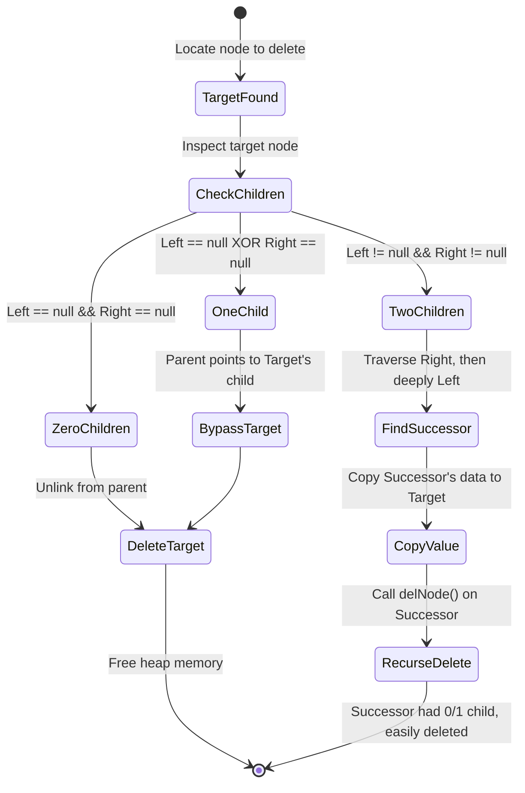

## 1. Overview

This document covers the bedrock of computer science and software engineering: memory management, algorithmic complexity, and foundational data structures. Moving from high-level scripting down to C++ means we now manually control memory allocation, pointer dereferencing, and the specific cost of every iteration. I've broken down how data structures like linked lists, stacks, and binary search trees physically exist in memory, how we measure their performance using asymptotic bounds, and how to implement recursive algorithms like Quicksort and Quickselect from scratch. 

## 2. Theoretical Foundations

### 2.1 Algorithmic Complexity Analysis

**Theoretical Intuition**

When evaluating an algorithm, clock time is useless because hardware speeds vary. Instead, we measure how the execution time or memory footprint scales relative to the input size $N$. 
*   **Big-O ($O$)** represents the upper bound (the worst-case scenario).
*   **Big-Omega ($\Omega$)** represents the lower bound (the absolute best-case scenario).
*   **Big-Theta ($\Theta$)** represents a tight bound (when the upper and lower bounds grow at the exact same rate).

**Mathematical Derivation**

Formally, a function $f(n)$ belongs to the set $O(g(n))$ if there exist positive constants $c$ and $n_0$ such that for all $n \ge n_0$:
$$ f(n) \le c \cdot g(n) $$

When analyzing polynomials, we drop all lower-order terms and constant multipliers because they become mathematically insignificant as $n \to \infty$. For example, given the execution time polynomial $T(n) = 4n^3 + 10n^2 + 5n$:
$$ \lim_{n \to \infty} \frac{4n^3 + 10n^2 + 5n}{n^3} = 4 $$
Because this converges to a constant, $T(n) \in O(n^3)$.

**Programmatic Implementation**

We determine the complexity of a routine by analyzing its nested loops. The following function contains three nested loops. The outer loop runs $n$ times. The middle loop runs $n \times n$ times starting from $i$ (which averages to $n^2/2$ iterations). The innermost loop runs a constant 100 times. 

```cpp
#include <iostream>

void testComplexity(int n) {
    int count = 0;
    // O(n)
    for (int i = 0; i < n; ++i) {
        // O(n^2)
        for (int j = i; j < n * n; ++j) {
            // O(1) - Constant time operation
            for (int k = 0; k < 100; ++k) {
                std::cout << "count: " << ++count << "\n";
            }
        }
    }
}
// Overall Time Complexity: O(n * n^2 * 1) = O(n^3)
```

### 2.2 Memory Management and Pointers

**Theoretical Intuition**

In C++, memory is divided into the Stack (automatically managed, fast, limited size) and the Heap (manually managed, slower allocation, enormous size). When we create variables normally, they live on the stack and die when the function returns. When we need objects to persist or when dealing with large datasets, we use `new` to allocate them on the Heap, which returns a Pointer (a memory address). If we lose that address without calling `delete`, the memory is permanently occupied until the program dies—this is a memory leak.

**Mathematical Derivation**

A pointer `p` holds an integer representing a memory address. Dereferencing `*p` or `p->` accesses the value at that address. Passing by value creates a full copy of the object, costing $O(K)$ where $K$ is the object's memory size. Passing by reference (`&`) passes the memory address, costing $O(1)$ and allowing modification.
$$ \text{Cost}(f(Obj)) = \text{sizeof}(Obj) $$
$$ \text{Cost}(f(Obj\&)) = \text{sizeof}(\text{void*}) $$

**Programmatic Implementation**

To handle heavy allocations without thrashing the heap, we use a Pool Allocator. This pre-allocates a large vector of objects and doles them out via pointers, reusing them when "freed" instead of actually destroying them.

```cpp
#include <vector>
#include <cstddef>

template <typename T>
class PoolAllocator {
private:
    std::vector<T*> pool;
    size_t currentUsed;
    size_t capacity;

public:
    PoolAllocator(size_t size) : currentUsed(0), capacity(size) {
        for (size_t i = 0; i < size; ++i) {
            pool.push_back(new T());
        }
    }

    ~PoolAllocator() {
        for (T* ptr : pool) {
            delete ptr;
        }
    }

    T* allocate() {
        if (currentUsed < capacity) {
            T* obj = pool[currentUsed];
            currentUsed++;
            return obj;
        }
        return nullptr; // Pool exhausted
    }

    void free(T* obj) {
        if (currentUsed > 0) {
            currentUsed--;
            pool[currentUsed] = obj; // Recycle the object
        }
    }
};
```

### 2.3 Linked Lists

**Theoretical Intuition**

Arrays require contiguous blocks of memory, which makes resizing expensive ($O(N)$). Linked lists solve this by allocating nodes dynamically anywhere in the heap and connecting them via pointers. A Singly Linked List points only to the next node. A Doubly Linked List points to both the next and previous nodes, allowing bidirectional traversal at the cost of extra memory per node.

**Mathematical Derivation**

Because memory is non-contiguous, we cannot use pointer arithmetic (like `arr[5]`) to jump to an index. We must traverse node-by-node.
Accessing index $k$:
$$ T(k) = \sum_{i=0}^{k} O(1) = O(k) $$
However, if we already have a pointer to the exact node, inserting or deleting takes constant time $O(1)$ because it only involves rewiring local pointers.

**Programmatic Implementation**

Here is a templated implementation of a Doubly Linked List insertion algorithm, handling the critical edge cases (empty list, head replacement, middle insertion, tail insertion).

```cpp
template <typename T>
class Node {
public:
    T data;
    Node<T>* next;
    Node<T>* prev;
    
    Node(T val) : data(val), next(nullptr), prev(nullptr) {}
};

template <typename T>
class LinkedList {
private:
    Node<T>* head;
    int listSize;

public:
    LinkedList() : head(nullptr), listSize(0) {}

    bool insertAt(const T& value, int index) {
        if (index > listSize || index < 0) return false;

        Node<T>* newNode = new Node<T>(value);

        if (index == 0) {
            if (head == nullptr) {
                head = newNode;
            } else {
                newNode->next = head;
                head->prev = newNode;
                head = newNode;
            }
        } else {
            Node<T>* temp = head;
            for (int i = 0; i < index - 1; i++) {
                temp = temp->next;
            }
            if (index == listSize) { // Insert at tail
                temp->next = newNode;
                newNode->prev = temp;
            } else { // Insert in middle
                newNode->next = temp->next;
                newNode->prev = temp;
                temp->next->prev = newNode;
                temp->next = newNode;
            }
        }
        listSize++;
        return true;
    }
};
```

### 2.4 Quickselect and Lomuto Partition

**Theoretical Intuition**

If we only need to find the $k$-th smallest element in an array (e.g., finding the median), fully sorting the array using Quicksort ($O(N \log N)$) is overkill. We can use Quickselect, which relies on the exact same Lomuto partition scheme but only recurses into the specific subarray that contains the $k$-th index. 

**Mathematical Derivation**

The Lomuto partition picks a pivot (usually the last element). It maintains two indices: $i$ tracks the boundary of elements smaller than the pivot, and $j$ scans the array. 
The recurrence relation for Quickselect, assuming the pivot roughly splits the array in half, is:
$$ T(N) = T(N/2) + O(N) $$
According to the Master Theorem, this resolves to an average time complexity of $O(N)$. In the worst case (if the array is already sorted and we pick the worst pivot), it degrades to $O(N^2)$.

**Programmatic Implementation**

```cpp
#include <vector>
#include <algorithm>

// Lomuto partition scheme
int partition(std::vector<int>& arr, int low, int high) {
    int pivot = arr[high];
    int i = low;

    for (int j = low; j < high; j++) {
        if (arr[j] <= pivot) {
            std::swap(arr[i], arr[j]);
            i++;
        }
    }
    std::swap(arr[i], arr[high]);
    return i; // Returns the final index of the pivot
}

int quickselect(std::vector<int>& arr, int low, int high, int k) {
    if (k > 0 && k <= high - low + 1) {
        int index = partition(arr, low, high);

        // If position is exactly what we are looking for
        if (index - low == k - 1) {
            return arr[index];
        }
        // If position is more, recurse left
        if (index - low > k - 1) {
            return quickselect(arr, low, index - 1, k);
        }
        // Else, recurse right
        return quickselect(arr, index + 1, high, k - index + low - 1);
    }
    return -1; // Out of bounds
}
```

### 2.5 Binary Search Trees (BST)

**Theoretical Intuition**

A Binary Search Tree optimizes for search operations by enforcing a strict geometric rule: every node in the left subtree is strictly less than the root, and every node in the right subtree is strictly greater. This allows binary search logic to map directly to pointer traversal. Deletion is the most complex operation, as removing a node with two children requires structural repair using the node's in-order successor (the smallest value in its right subtree).

**Mathematical Derivation**

The efficiency of a BST depends entirely on its height $h$. For $N$ nodes, a perfectly balanced tree has height:
$$ h = \lfloor \log_2(N) \rfloor $$
Yielding $O(\log N)$ search/insert/delete times. If the elements are inserted in ascending order, the tree degrades into a linked list ($h = N$), yielding $O(N)$ operations.

**Programmatic Implementation**

Here is the exact logic for deleting a node while preserving the BST property.

```cpp
struct Node {
    int key;
    Node* left;
    Node* right;
};

// Helper: Find the minimum value node in a tree
Node* getSuccessor(Node* curr) {
    curr = curr->right;
    while (curr != nullptr && curr->left != nullptr) {
        curr = curr->left;
    }
    return curr;
}

Node* delNode(Node* curr, int target) {
    if (curr == nullptr) return curr;

    if (target < curr->key) {
        curr->left = delNode(curr->left, target);
    } else if (target > curr->key) {
        curr->right = delNode(curr->right, target);
    } else {
        // Node found. 
        // Case 1 & 2: Node has one or zero children
        if (curr->left == nullptr) {
            Node* temp = curr->right;
            delete curr;
            return temp;
        } else if (curr->right == nullptr) {
            Node* temp = curr->left;
            delete curr;
            return temp;
        }

        // Case 3: Node has two children
        Node* succ = getSuccessor(curr);
        curr->key = succ->key; // Copy successor's data to this node
        // Delete the successor from the right subtree
        curr->right = delNode(curr->right, succ->key); 
    }
    return curr;
}
```

### 2.6 Postfix Expression Evaluation (Stacks)

**Theoretical Intuition**

Mathematical expressions are usually written in Infix notation (e.g., `5 + 2`), which requires parentheses to dictate order of operations. Postfix notation (Reverse Polish Notation) eliminates the need for parentheses by placing the operator immediately after its operands (e.g., `5 2 +`). A Stack (LIFO data structure) makes parsing postfix expressions computationally trivial.

**Mathematical Derivation**

Let $E$ be a postfix expression consisting of operands $O$ and binary operators $\oplus$. We iterate through $E$:
1. If element $e \in O$, `Push(e)`.
2. If element $e \in \oplus$:
   $$ v_2 \leftarrow \text{Pop()} $$
   $$ v_1 \leftarrow \text{Pop()} $$
   $$ \text{Push}(v_1 \oplus v_2) $$
The final result is the single remaining element in the stack.

**Programmatic Implementation**

```cpp
#include <stack>
#include <string>
#include <vector>
#include <stdexcept>

int evaluatePostfix(const std::vector<std::string>& tokens) {
    std::stack<int> s;

    for (const std::string& token : tokens) {
        if (token == "+" || token == "-" || token == "*" || token == "/") {
            int right = s.top(); s.pop();
            int left = s.top(); s.pop();

            if (token == "+") s.push(left + right);
            else if (token == "-") s.push(left - right);
            else if (token == "*") s.push(left * right);
            else if (token == "/") s.push(left / right);
        } else {
            // It's a number, push to stack
            s.push(std::stoi(token));
        }
    }
    return s.top();
}
```

## 3. Comparative Analysis

| Concept | Upper Bound $O(n)$ | Tight Bound $\Theta(n)$ | Lower Bound $\Omega(n)$ | Use Case |
| :--- | :--- | :--- | :--- | :--- |
| **Selection Sort** | $O(N^2)$ | $\Theta(N^2)$ | $\Omega(N^2)$ | Small arrays, minimal memory writes required. |
| **Insertion Sort** | $O(N^2)$ | $\Theta(N^2)$ | $\Omega(N)$ | Arrays that are already mostly sorted. |
| **Quicksort** | $O(N^2)$ | $\Theta(N \log N)$ | $\Omega(N \log N)$ | Default, cache-friendly in-place sorting. |
| **Binary Search** | $O(\log N)$ | $\Theta(\log N)$ | $\Omega(1)$ | Finding elements in a strictly ordered array. |

| Parameter Passing Strategy | Syntax | Memory Cost | Modifiability |
| :--- | :--- | :--- | :--- |
| **Pass by Value** | `void func(int x)` | $O(N)$ (Full Copy) | Cannot modify original. |
| **Pass by Reference** | `void func(int& x)` | $O(1)$ (Pointer copy) | Modifies original directly. |
| **Pass by Const Reference**| `void func(const int& x)`| $O(1)$ (Pointer copy) | Read-only access to original. |

## 4. System / Sequence Architecture

The state machine below models the specific pointer and memory state transitions during the deletion of a Binary Search Tree node that possesses two children, which relies on the `getSuccessor` logic implemented in §2.5.



## 5. Worked Examples

**Example 1: Infix to Postfix Conversion**
Convert the expression `A * (B + C)` into Postfix notation using a Stack.
1. Scan `A`: Operand. Output: `A`. Stack: `[]`.
2. Scan `*`: Operator. Push to stack. Output: `A`. Stack: `[*]`.
3. Scan `(`: Parenthesis. Push to stack. Output: `A`. Stack: `[*, (]`.
4. Scan `B`: Operand. Output: `A B`. Stack: `[*, (]`.
5. Scan `+`: Operator. Push to stack. Output: `A B`. Stack: `[*, (, +]`.
6. Scan `C`: Operand. Output: `A B C`. Stack: `[*, (, +]`.
7. Scan `)`: Closing parenthesis. Pop until `(`.
   * Pop `+`. Output: `A B C +`.
   * Pop `(`. Discard. Stack: `[*]`.
8. End of string. Pop remaining operators. Output: **`A B C + *`**.

**Example 2: Mathematical Induction Proof**
Prove the recursive function $f(x, n)$ accurately calculates $x^n$ for all $n \ge 0$.
The function is: `if (n == 0) return 1; else return x * func(x, n-1);`

1. **Base Case ($n=0$)**: $f(x, 0)$ evaluates the `if` block and returns $1$. Mathematically, $x^0 = 1$. The base case holds.
2. **Inductive Hypothesis**: Assume $P(k)$ is true. Therefore, $f(x, k) = x^k$ for some integer $k \ge 0$.
3. **Inductive Step**: Show that $P(k+1)$ is true.
   Evaluate $f(x, k+1)$. It fails the base case and executes the `else` block:
   $$ f(x, k+1) = x \cdot f(x, (k+1) - 1) $$
   $$ f(x, k+1) = x \cdot f(x, k) $$
   Substitute the Inductive Hypothesis $f(x, k) = x^k$:
   $$ f(x, k+1) = x \cdot x^k $$
   $$ f(x, k+1) = x^{k+1} $$
   The inductive step holds. By the principle of mathematical induction, the function accurately calculates $x^n$.

## 6. Common Pitfalls

> Do not return a reference or a pointer to a local stack variable. Once the function returns, its stack frame is destroyed. The returned pointer will point to garbage memory, leading to unpredictable crashes or silent data corruption.

> Do not use `delete` to deallocate an array created with `new[]`. You must use `delete[] ptr`. Using the scalar `delete` only destroys the first object in the array block, leaking the remaining memory.

> Do not assume Big-O notation dictates exact execution speed. An $O(N)$ algorithm with massive constant factors can run significantly slower than an $O(N^2)$ algorithm for small inputs. Big-O strictly describes the scaling curve as $N \to \infty$.

> Dereferencing pointers via `ptr.method()` is a syntax error. Because a pointer holds a memory address, not an object instance, you must use the arrow operator `ptr->method()` or explicitly dereference it first `(*ptr).method()`.