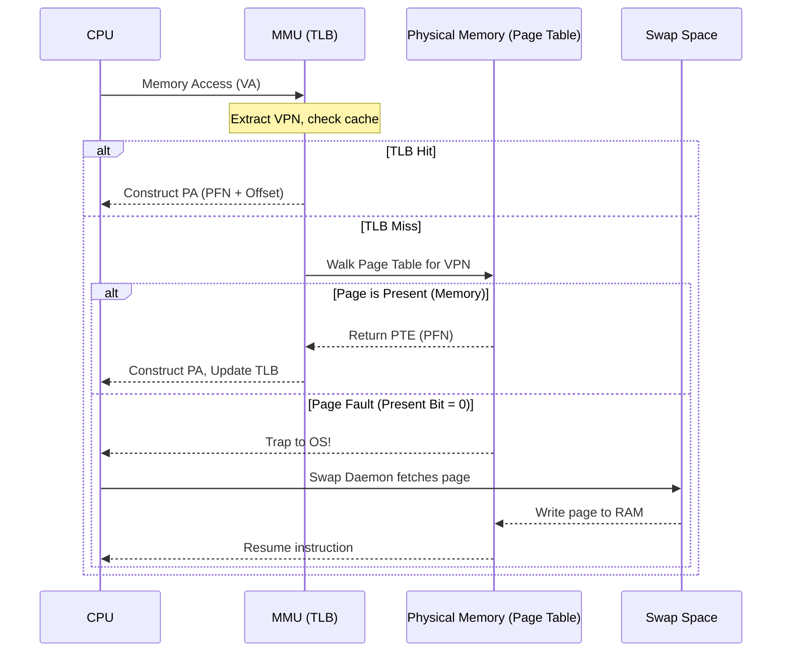

## 1. Overview

The Operating System acts as a "Resource Manager," taking lifeless static code sitting on a disk and running it as a live process. A massive part of this illusion is Memory Virtualization. The OS gives every running program the illusion of a massive, private, and contiguous address space, even though multiple processes are actively sharing the physical RAM.

To achieve transparency and protection, the hardware Memory Management Unit (MMU) intercepts every memory reference, translating Virtual Addresses (VAs) into Physical Addresses (PAs). I've broken down the two main mechanisms used to map these addresses—Segmentation and Paging—moving from the problem of internal fragmentation to the modern solution of fixed-size pages.

## 2. Theoretical Foundations

### 2.1 Segmentation

**Theoretical Intuition**

A simple base-and-bounds register setup creates massive internal fragmentation because the free space between the heap (growing upwards) and the stack (growing downwards) is allocated in physical memory but entirely unused. Segmentation solves this by creating a base/bound pair for each logical segment (code, heap, stack). We can place each segment independently in physical memory, leaving the gaps unallocated.

**Mathematical Derivation**

To translate an address under segmentation, we split the Virtual Address ($VA$) into two parts: the top bits determine the segment, and the remaining bits determine the offset within that segment.

Let $N_{total}$ be the total bits in the $VA$ and $N_{seg}$ be the number of bits used to identify the segment.

$$SegmentID = VA \gg (N_{total} - N_{seg})$$

$$Offset = VA \ \& \ (\sim0 \gg N_{seg})$$

For positively growing segments (Code, Heap):


$$PA = Base_{SegmentID} + Offset$$

For negatively growing segments (Stack), we must subtract the maximum segment size ($Size_{max}$) from the offset before adding it to the base:


$$PA = Base_{SegmentID} + (Offset - Size_{max})$$

**Programmatic Implementation**

```c
// Simulating an MMU translating a segmented Virtual Address
#include <stdint.h>
#include <stdio.h>

#define MAX_SEGMENT_SIZE 1024 // 1KB segments

typedef struct {
    uint32_t base;
    uint32_t limit;
    int grows_negative;
} SegmentRegister;

uint32_t translate_segmentation(uint32_t va, SegmentRegister* seg_table, int offset_bits) {
    uint32_t segment_id = va >> offset_bits;
    uint32_t offset_mask = (1 << offset_bits) - 1;
    uint32_t offset = va & offset_mask;
    
    SegmentRegister seg = seg_table[segment_id];
    
    if (seg.grows_negative) {
        // Compute negative offset from the top
        int negative_offset = (int)offset - MAX_SEGMENT_SIZE;
        uint32_t pa = seg.base + negative_offset;
        
        // Bounds check (absolute value of negative_offset must be <= limit)
        if ((uint32_t)(-negative_offset) > seg.limit) {
            printf("Segmentation violation!\n");
            return 0; // Fault
        }
        return pa;
    } else {
        if (offset > seg.limit) {
            printf("Segmentation violation!\n");
            return 0; // Fault
        }
        return seg.base + offset;
    }
}

```

### 2.2 Paging

**Theoretical Intuition**

While segmentation eliminates internal fragmentation, it causes external fragmentation—free space on the physical disk gets chopped into oddly sized holes. To fix this, we need compaction, where the OS stops processes and copies data to new locations to merge free space. Paging is a better approach: it completely abandons variable-sized chunks. We divide the virtual address space into N fixed-size virtual pages, and the physical memory into page frames. A Page Table tracks which Virtual Page Number maps to which Page Frame Number (PFN).

**Mathematical Derivation**

We split the $VA$ into a Virtual Page Number ($VPN$) and an offset. The offset remains identical in both the virtual and physical address.

Let $S_{page}$ be the size of a page in bytes.


$$VPN = \lfloor \frac{VA}{S_{page}} \rfloor$$

$$Offset = VA \pmod{S_{page}}$$

The $VPN$ is used as an index into the Page Table to find the corresponding Physical Frame Number ($PFN$). The Page Table Entry (PTE) also contains a Valid bit, Protection bits, and a Present bit to handle swapping.

$$PA = (PFN \times S_{page}) + Offset$$

**Programmatic Implementation**

```c
// Simulating a simple linear page table translation
#include <stdint.h>
#include <stdio.h>

#define PAGE_SIZE 4096 // 4KB pages

typedef struct {
    uint32_t pfn;
    int valid_bit;
    int present_bit;
} PageTableEntry;

uint32_t translate_paging(uint32_t va, PageTableEntry* pt) {
    uint32_t vpn = va / PAGE_SIZE;
    uint32_t offset = va % PAGE_SIZE;
    
    PageTableEntry pte = pt[vpn];
    
    if (!pte.valid_bit) {
        printf("Segfault: Invalid memory access.\n");
        return 0;
    }
    if (!pte.present_bit) {
        printf("Page Fault: OS needs to fetch from swap space.\n");
        return 0;
    }
    
    return (pte.pfn * PAGE_SIZE) + offset;
}

```

## 3. Comparative Analysis

| Feature | Base & Bounds | Segmentation | Paging |
| --- | --- | --- | --- |
| **Address Space Division** | 1 large contiguous chunk.

 | Variable-sized logical segments (Code, Heap).

 | Fixed-size units (Pages).

 |
| **Internal Fragmentation** | High (massive unused gap).

 | Low (gaps aren't mapped).

 | Moderate (only within the last page). |
| **External Fragmentation** | None. | High (creates holes requiring compaction).

 | None (all frames are identical sizes).

 |
| **Hardware Required** | 1 pair of registers.

 | Table of segment registers.

 | Page Table in Memory + TLB.

 |

## 4. System / Sequence Architecture



## 5. Worked Examples

**Example 1: Translating a Segmented Address**

Given an address space size of 1K (1024 bytes) and a virtual address $VA = 941$ (0x03ad), translate it to a physical address. We are given that the top 2 bits represent the segment, and Segment 1 (grows negative) has a Base of 2158 and a Limit of 309.

1. Convert $VA = 941$ to binary: `11 1010 1101`.


2. The top two bits `11` dictate Segment 1.


3. The remaining bits are the offset: `1010 1101` (binary) = $941$ (Wait, the offset is actually the lower bits. In a 10-bit address space, `11` is segment 3. Let's look at the specific trace rule: 1024 byte space means 10 bits. 941 is `11 1010 1101`. Segment 1 is indicated by the top bits, and the actual offset is 941.


4. Because it grows negatively, subtract the maximum segment size: $1024 - 941 = 83$. (This is the negative offset from the base).


5. Calculate PA: $Base - NegativeOffset = 2158 - 83 = 2075$ (Wait, the specific output trace says $2158 - 83 = 0x0000081b$ which is 2075 in decimal).


6. PA is `0x0000081b`.


**Example 2: Translating a Paged Address**

Given an address space size of 16KB, a physical memory size of 64KB, a page size of 4KB, and a $VA = 7895$ (0x1ed7). Page 1 has a valid bit of 1 and $PFN = 1$.

1. Convert $VA = 7895$ to binary: `01 1110 1101 0111`.


2. Since page size is 4KB ($2^{12}$), the bottom 12 bits are the offset: `1110 1101 0111` (0xed7).


3. The top 2 bits (since $16KB = 2^{14}$) are the $VPN$: `01` (Page 1).


4. Page 1 maps to $PFN = 1$.


5. Construct PA: $PFN$ (1) combined with offset (0xed7) results in $PA = \text{0x1ed7}$.


## 6. Common Pitfalls

> When dealing with the stack under segmentation, you cannot simply add the offset to the base address. Because the stack grows negatively, you must calculate the negative offset by subtracting the maximum segment size from the virtual offset ($Offset - Size_{max}$) before applying it to the base. If you don't do this, you'll reference memory well outside your allocated physical limits and trigger a segmentation violation.
> 
> 

> Do not confuse the Present Bit with the Valid Bit in a Page Table Entry. The Valid Bit tells the hardware if the process actually owns that virtual page (a 0 means a segfault). The Present Bit simply tells the hardware whether the data is currently in physical RAM or if it has been swapped out to disk (a 0 triggers a page fault handler to go get it).
> 
>